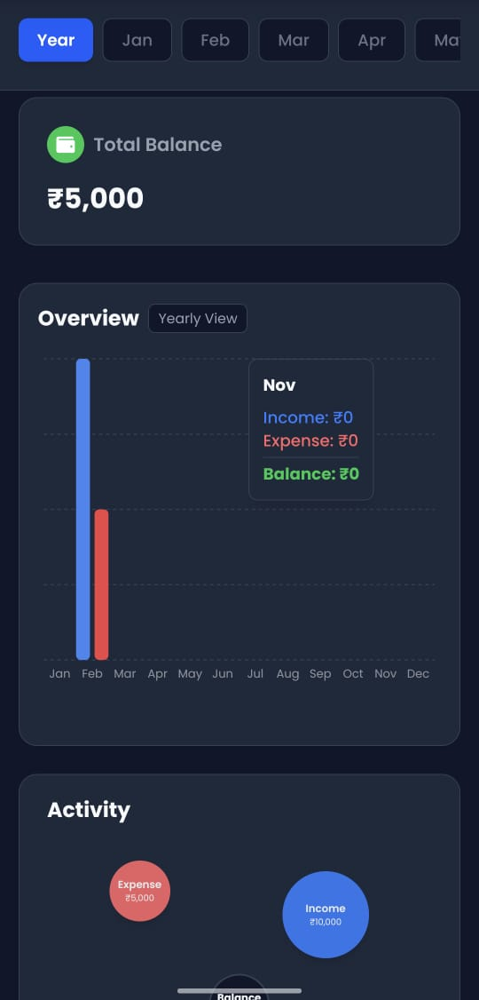
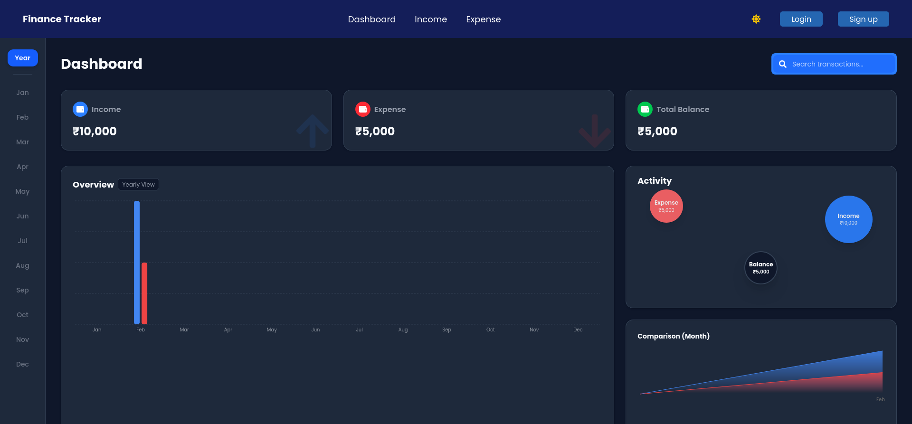

# Finance Tracker

A powerful, high-performance web application designed to help users regain consciousness of their financial health in the age of seamless digital transactions.

## 🚀 The Vision & Impact

In today's world of "one-click" payments and services like GPay, spending money has become almost frictionless. While convenient, this ease of transaction often leads to a loss of financial consciousness, where users lose track of their micro-expenditures and cumulative spending habits.

**Finance Tracker** is built to solve this by:
- **Promoting Mindfulness**: Forcing a deliberate action of logging transactions to help users stay aware of every rupee spent or earned.
- **Cross-Device Accessibility**: Accessible from any preferred device, allowing users to log transactions on the go.
- **Hybrid Data Storage**: Flexible data management that caters to both casual users and those seeking long-term synchronization.
  - **Local System**: Data is stored securely in your browser's local storage for immediate use without an account.
  - **Cloud Sync (MongoDB)**: Logged-in users can sync their data across devices using their Google ID, ensuring their financial history is never lost.





## 🛠 Technical Stack

This project leverages modern web technologies to provide a premium, responsive, and secure experience:

- **Framework**: [Next.js 14](https://nextjs.org/) (App Router) for a fast, SEO-friendly React foundation.
- **Authentication**: [NextAuth.js](https://next-auth.js.org/) with Google Provider for secure, passwordless login.
- **Database**: [MongoDB](https://www.mongodb.com/) with [Mongoose](https://mongoosejs.com/) for reliable and scalable data persistence.
- **Styling**: [Tailwind CSS](https://tailwindcss.com/) for high-performance, utility-first UI design.
- **Theming**: Custom Dark Mode infrastructure using CSS Variables and React Context for a seamless, high-contrast low-light experience.
- **Data Visualization**: [Recharts](https://recharts.org/) for beautiful, interactive analytics, area charts, and bar graphs.
- **Icons**: [React Icons](https://react-icons.github.io/react-icons/) for a consistent and intuitive visual language.

## ✨ Key Features

- **Dashboard**: A bird's-eye view of your financial health with dynamic activity spheres, monthly comparisons, and detailed overview graphs.
- **Income & Expense Management**: Dedicated modules to track earnings and spendings with real-time analytics and status badges.
- **Dark Mode**: A beautiful, premium dark theme that respects system preferences and persists across sessions.
- **Responsive Design**: Fully optimized for desktops, tablets, and smartphones.
- **Search & Filter**: Quickly find any transaction in your history with real-time filtering.

## 🏁 Getting Started

### Prerequisites

- Node.js 18.x or later
- A MongoDB database (local or Atlas)
- Google OAuth credentials (for authentication)

### Installation

1. Clone the repository:
   ```bash
   git clone [<repository-url>](https://github.com/RamSivaSundaraKarthykeyan/finance-tracker-the-actual.git)
   ```

2. Install dependencies:
   ```bash
   npm install
   ```

3. Configure your environment:
   Create a `.env.local` file in the root directory and add:
   ```env
   MONGODB_URI=your_mongodb_uri
   NEXTAUTH_SECRET=your_auth_secret
   GOOGLE_CLIENT_ID=your_google_id
   GOOGLE_CLIENT_SECRET=your_google_secret
   NEXTAUTH_URL=http://localhost:3000
   ```

4. Run the development server:
   ```bash
   npm run dev
   ```

Open [http://localhost:3000](http://localhost:3000) with your browser to explore the app.
